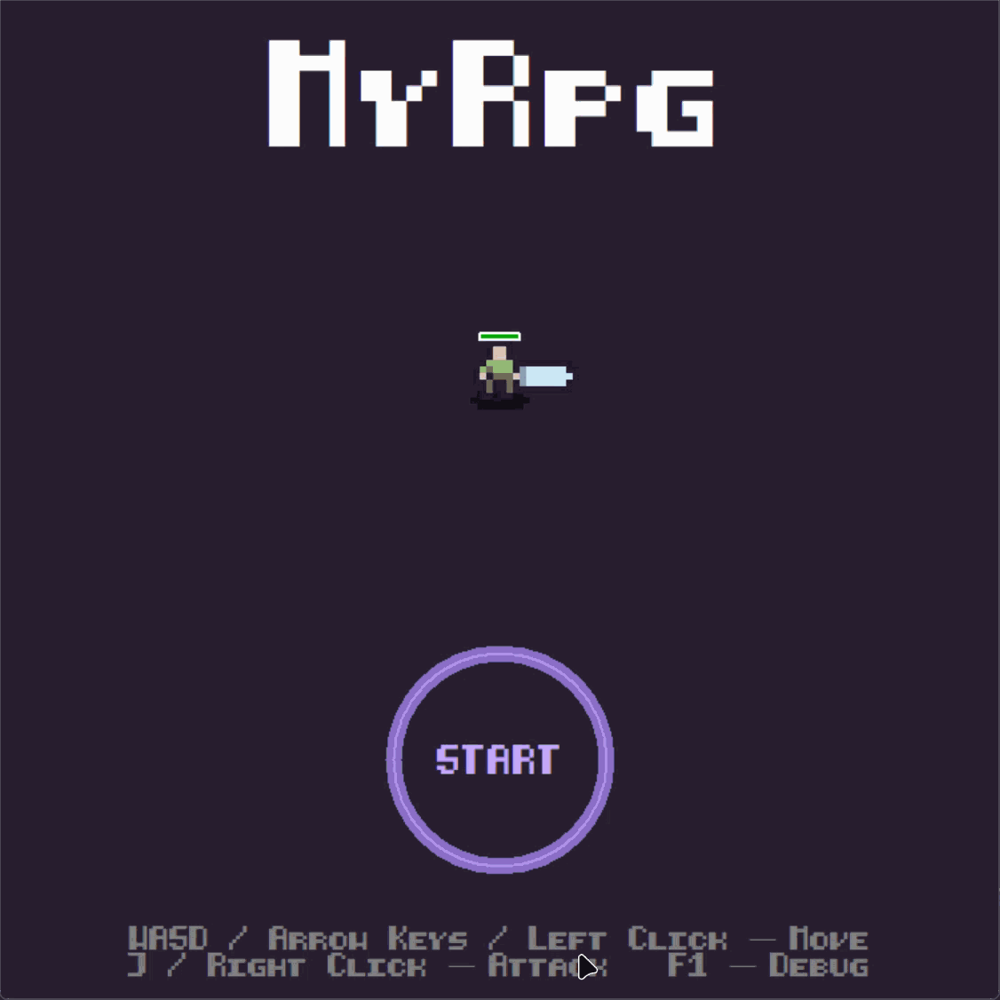
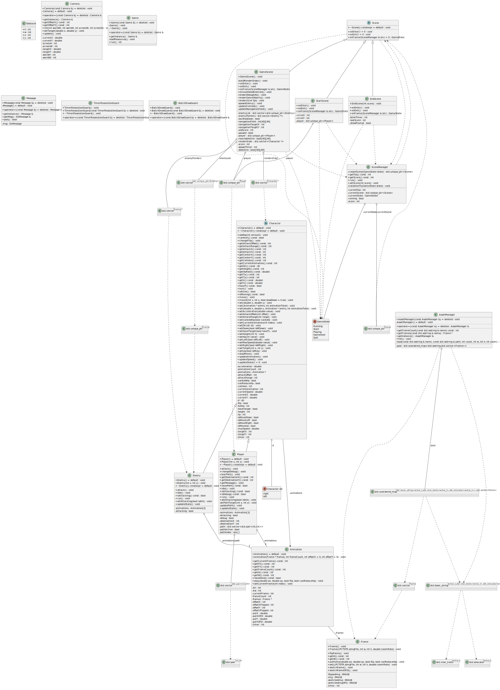

# MyRpg

基于 EasyX 的 Windows 2D 动作 RPG 课程项目。项目使用 C++20 和 Visual Studio 2022，实现了开始、游戏、结算三场景，鼠标点击 A* 移动、敌人追击、随机障碍、战斗、相机跟随与帧率显示。

## 运行与构建

环境：Windows、Visual Studio 2022、MSVC v145、EasyX、C++20。用 Developer PowerShell 在项目根目录执行：

```powershell
msbuild .\MyRpg\MyRpg.vcxproj /p:Configuration=Debug /p:Platform=x64
.\MyRpg\x64\Debug\MyRpg.exe
```

资源位于 `MyRpg/source/`；`MyRpg/x64/` 为生成目录。

| 操作 | 功能 |
| --- | --- |
| `WASD` / 方向键 | 手动移动；按下时取消点击路径。 |
| 左键释放 | 设定世界坐标目标，执行 A* 点击移动。 |
| 右键 / `J` | 朝鼠标方向攻击。 |
| `F1` | 显示或隐藏碰撞、攻击范围和敌人连线调试信息。 |
| `Esc` | 暂停或继续游戏。 |

## 演示

四个演示 GIF 位于 `docs/media/`。

### 开始与场景切换



展示开始界面、玩家走入 START 圈和进入战斗场景。

### 点击移动与 A*


展示目标标记、被障碍阻挡时的绕路、抵达目标后停止，以及键盘输入取消路径。

### 敌人导航与群体分离


展示敌人从可达边缘生成、共享导航场绕墙，以及近距离敌人的局部分离。

### 战斗与调试


展示攻击、受伤闪白、血条、得分和 `F1` 调试范围。

## 类设计



类图由 clang-uml 根据当前源码生成，配置在 `.clang-uml`，编译数据库在 `compile_commands.json`。更新命令：

```powershell
clang-uml -c .clang-uml
plantuml -tsvg docs/diagrams/project_class_diagram.puml
```

| 模块 | 职责 |
| --- | --- |
| `Game` | 单例入口；初始化窗口、字体、音频和资源，使用 `BatchDrawGuard` 管理批量绘制。 |
| `SceneManager` / `Scene` | 场景工厂与状态切换；`StartScene`、`GameScene`、`EndScene` 分别处理菜单、战斗和结算。`TimerResolutionGuard` 管理 Windows 定时器精度。 |
| `Character` | 玩家和敌人的抽象基类，提供移动、朝向、动画索引、生命、攻击范围与圆形碰撞半径。 |
| `Player` / `Enemy` | 都有 Idle、Run、Attack 三组动画。`Player` 负责消息输入与点击路径；`Enemy` 由 `FishAI` 决定移动。 |
| `Camera` | 单例相机，维护世界到屏幕的偏移，按 `CAMERA_LERP` 平滑跟随玩家。 |
| `AssetManager` | 单例资源池。`init()` 只加载一次所有 `Frame`，`Animation` 保存 `Frame*`，角色不会重复加载同一组 PNG。 |
| `Frame` / `Animation` | `Frame` 预生成原图、翻转图与受伤闪白图；`Animation` 维护播放帧、速度和攻击判定。 |
| `Message` | 单例输入包装，按帧用 `peekmessage` 取出所有 EasyX 消息。 |
| `collision.*` / `FishAI` | 障碍、网格、A*、共享导航场和敌人局部分离。 |

`GameScene` 拥有 `Player`、`Enemy` 列表、可走网格、可达网格和导航场；渲染前把角色放进 `renderOrder`，按世界 Y 坐标排序，实现前后遮挡关系。

### 场景状态机

项目使用有限状态机（Finite State Machine, FSM）管理不同界面，而不是在一个循环中混杂开始、战斗和结算逻辑。`GameState` 定义 `Start`、`Playing`、`GameOver`、`Quit` 和帧内保持状态 `Running`；每个 `Scene` 都遵循 `onEnter()`、`onFrame(SceneManager&)`、`onExit()` 生命周期。

```text
StartScene --走入 START 圈--> GameScene --玩家死亡--> EndScene
    ^                              |                         |
    |                              | Esc                     | Enter
    +------------------------------+-------------------------+
                                   Quit
```

`SceneManager::run()` 每帧调用当前场景的 `onFrame()`。场景只返回下一个 `GameState`，而 `SceneManager::transitionTo()` 统一负责调用旧场景 `onExit()`、创建新场景、调用新场景 `onEnter()` 并传递分数。这样场景切换的资源初始化和清理有固定位置，战斗代码不依赖开始或结算 UI 的状态。

## 世界、相机与资源

世界尺寸为 `2000 x 2000`，窗口为 `750 x 750`，像素素材按 `ZOOM_RATE=5` 放大。游戏对象始终保存世界坐标。渲染时 `GameScene` 使用 `SetViewportOrgEx` 平移画布，UI 在恢复 viewport 后绘制，因此不会跟随相机移动。

资源共享由 `AssetManager::pool` 的 `unordered_map<wstring, vector<Frame>>` 完成。启动阶段加载角色帧、字体和音频；运行中角色构造函数仅取得帧数组地址。这样避免了敌人生成时的磁盘 I/O、重复图片解码和额外图像内存。

## 障碍与碰撞

障碍是随机生成的轴对齐矩形。矩形允许重叠，逻辑上不再把两个矩形扩展成外接大矩形：圆形角色碰撞逐个使用“矩形最近点到圆心距离”判定，等价于矩形集合的真实并集。绘制时先纯填充每个矩形，再将每条边按相交位置切段；只有边两侧一个在并集内、一个在并集外时才画线，因此重叠区域没有内部边框。

生成后按 `50 x 50` 网格建立可走图。以玩家出生格为起点进行八方向 BFS，禁止穿过两个对角障碍的夹角。若玩家连通区在任一地图边缘少于两个可出生格，就撤销最后生成的墙块并重新验证。敌人只从 `reachableGrid` 的边缘格出生，避免落在孤立区域。

#### 核心碰撞实现

`MyRpg/collision.cpp` 将圆心钳制到矩形范围，随后只比较一次平方距离，不调用开方：

```cpp
bool collideCircleRect(int cx, int cy, int cr, const Obstacle &o)
{
	int nearX = cx < o.x ? o.x : (cx > o.x + o.w ? o.x + o.w : cx);
	int nearY = cy < o.y ? o.y : (cy > o.y + o.h ? o.y + o.h : cy);
	int dx = cx - nearX, dy = cy - nearY;
	return dx * dx + dy * dy < cr * cr;
}
```

这同一判定同时服务于角色移动、网格可走性和障碍并集外轮廓绘制，避免维护多套不一致的碰撞规则。

## 寻路与敌人 AI

### 玩家 A*

玩家左键释放后，将屏幕坐标转换为世界坐标并建立本次 A* 网格。A* 使用优先队列、`gScore` 和父节点回溯；直移代价为 10、斜移为 14，启发式为 `10 * max(dx, dy) + 4 * min(dx, dy)`。斜走要求两个正交邻格都可通行。若目标格被墙覆盖，会在其附近 `5 x 5` 格内选择最近可走格。

回溯得到的网格中心路径通过 Bresenham 直线检查平滑，删除不必要路点，同时再次禁止对角穿角。若真实点击点未碰墙且与末路点可直达，则追加为最终路点。玩家距离当前路点小于 `PATH_WAYPOINT_DISTANCE` 时切换下一点，到达后清空路径并停止移动。

#### A* 的关键松弛

`MyRpg/collision.cpp` 使用 `gScore` 防止更差路径覆盖已有结果，并在斜走时检查两个正交格：

```cpp
if (!grid[ny][nx] || closed[ny][nx])
	continue;
if (i >= 4 && (!grid[gy][nx] || !grid[ny][gx]))
	continue;

int nextG = node.g + (i < 4 ? 10 : 14);
if (nextG >= gScore[ny][nx])
	continue;
gScore[ny][nx] = nextG;
parent[ny][nx] = {node.gx, node.gy};
open.push({nx, ny, nextG, nextG + heuristic(nx, ny, tgx, tgy)});
```

### 敌人导航场

敌人直线可见玩家时直接追击。视线被障碍截断时，不为每个敌人重复运行 A*；`GameScene` 仅在玩家进入新网格时，从玩家格对整张 `40 x 40` 网格执行一次八方向 BFS，生成到目标的步数场。受阻敌人选择相邻且导航值更小的格子中心作为局部目标。该方法把多敌人同目标的搜索成本从“每个敌人一次 A*”降为“一次共享 BFS”。

#### 导航场下降规则

`MyRpg/ai.cpp` 的敌人只在可走格中选择导航值下降的邻居；没有下降邻居才在两格内做一次可见性兜底，仍失败则停止，避免穿墙抖动：

```cpp
if (!walkGrid[ny][nx] || navigationField[ny][nx] >= bestCost)
	continue;
if (i >= 4 && (!walkGrid[gy][nx] || !walkGrid[ny][gx]))
	continue;
bestX = nx;
bestY = ny;
bestCost = navigationField[ny][nx];

if (bestX != gx || bestY != gy)
	moveWithSeparation(self, bestX * CELL_SIZE + CELL_SIZE / 2,
				   bestY * CELL_SIZE + CELL_SIZE / 2, allies);
else
	self.stopMove();
```

### 群体分离

完整 AFSA 是随机迭代的离线优化算法，不适合作为 60 FPS 的逐帧追击方案。本项目只采用其对实时行为有价值的局部感知与拥挤控制：敌人在 `FISH_VISUAL_RANGE` 内检查同伴，距离小于 `FISH_SEPARATION_RANGE` 时按距离比例叠加反向转向力，再与追击或导航场方向合成。攻击距离内仍会执行分离，避免多个敌人叠在玩家同一点。该实现是轻量群体避让，不是完整 AFSA，也没有引入随机觅食或全局公告牌。

## 帧率与性能策略

- `SceneManager` 使用 `steady_clock` 的固定帧间隔，先 `sleep_until`，最后短暂 `yield` 补足精度；严重掉帧后重置目标时间，避免连续追帧。
- `BeginBatchDraw`/`FlushBatchDraw`/`EndBatchDraw` 降低 EasyX 刷新开销。
- 图像、翻转图和闪白图在启动期预处理；资源和相机使用单例，场景和实体使用 `unique_ptr` 表达所有权。
- 障碍网格只在地图生成时构建；敌人导航场只在玩家跨格时重建；敌人指针列表与渲染排序容器预留容量。
- 直线视线检测使用线段与扩张矩形的参数裁剪，避免沿线逐像素采样。

## 已知限制

- 敌人之间采用转向分离而非实体刚体碰撞；高密度狭窄通道仍可能短暂拥挤。
- 导航场适合静态墙体；运行时增删障碍后需要重新构建网格和可达区。
- 玩家每次点击都会执行一次 A*，当前 `40 x 40` 地图足够；更大地图应使用分区或增量寻路。
- 障碍外轮廓绘制按矩形对比较，当前约 60 块墙可接受；墙体数量大幅提高时应缓存轮廓线段。
- 随从系统尚未接入，具体计划见 [TODO.md](TODO.md)。

## 目录

```text
.
├── MyRpg/                         工程源码与资源
│   ├── rpgMain.cpp                程序入口
│   ├── game.*, sceneManager.*     主循环与场景切换
│   ├── startScene.*, gameScene.*, endScene.*
│   ├── character.*, player.*, enemy.*
│   ├── collision.*, ai.*          碰撞、寻路与群体导航
│   ├── asset.*, frame.*, animation.*
│   ├── camera.*, message.*
│   └── source/                    图片、字体和音频资源
├── docs/
│   ├── diagrams/                  clang-uml 类图（PUML 与 SVG）
│   └── media/                     功能演示 GIF
├── README.md
├── TODO.md
├── AGENTS.md
└── MyRpg.sln
```
